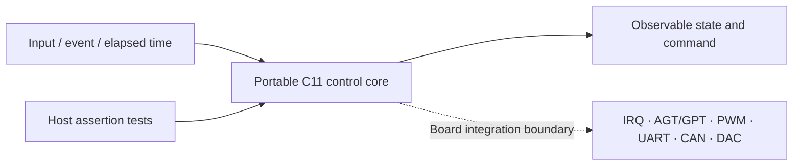
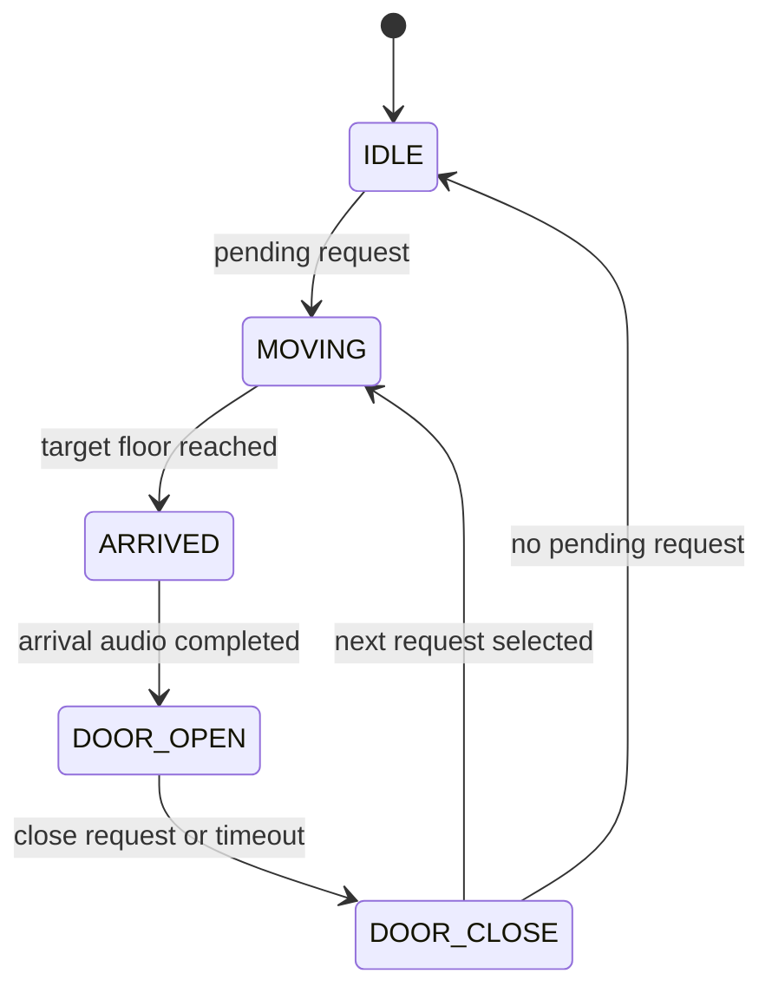
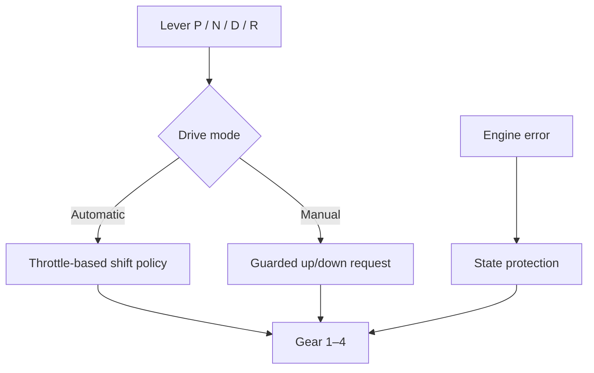

# RA6M3 Microprocessor Laboratory Portfolio

[한국어](README.md) | [English](README.en.md)

> Portable C11 state-machine extractions of an elevator controller and an educational TCU built during Renesas EK-RA6M3 coursework. The control cores compile and run on a host PC without publishing FSP-generated projects or course skeletons.

| Item | Details |
|---|---|
| Public projects | Three-floor elevator controller; four-speed educational TCU |
| Focus | State machines, non-blocking control, timer-driven transitions, peripheral abstraction |
| Original target | Renesas EK-RA6M3 / R7FA6M3AH3CFC |
| Public validation | ISO C11 build, assertion-based host tests |
| Excluded | FSP-generated code, course skeletons, pin configuration, personal data, raw audio |

## Quick Navigation

- [`src/elevator.c`](src/elevator.c) · [`include/elevator.h`](include/elevator.h): elevator state and scheduling core
- [`tests/test_elevator.c`](tests/test_elevator.c): elevator transition and request-handling tests
- [`src/tcu.c`](src/tcu.c) · [`include/tcu.h`](include/tcu.h): TCU mode and shifting core
- [`tests/test_tcu.c`](tests/test_tcu.c): automatic and manual shift-condition tests
- [`docs/lab-index.md`](docs/lab-index.md): coursework topics and disclosure treatment

## 1. Project Overview

The application logic was separated from board-specific FSP initialization and peripheral calls, then reconstructed as small C modules driven only by inputs and elapsed time. The control flow can therefore be reviewed and tested without the board, while generated code and course materials remain private.



## 2. Elevator Controller

### State structure



### Implementation

- Five non-blocking states: `IDLE → MOVING → ARRIVED → DOOR_OPEN → DOOR_CLOSE`
- A `pending` buffer for requests across three floors
- Direction-priority scheduling with intermediate stops
- Time-driven floor estimation and arrival conditions
- Explicit completion gating for the arrival sound before door opening
- Immediate-close requests or timer-based door closing

The original board submission connected floor-button IRQs, AGT timekeeping, GPT motor/servo PWM, UART GUI commands, CAN status frames, FND multiplexing, and DAC arrival audio. The public core replaces those peripherals with inputs and observable state.

## 3. Educational TCU

### Control flow



### Implementation

- Separate P/N/D/R lever state and automatic/manual drive modes
- Gear-state management from first through fourth
- Throttle-based automatic upshift and downshift
- Separate up/down thresholds to reduce gear hunting around a boundary
- Rejection of invalid manual shift requests
- Small functions for initialization, lever cycling, mode switching, and shift policy

## 4. My Contribution

- Extracted the elevator scheduler and TCU shift logic from personal MCU coursework into public reviewable cores
- Replaced blocking-delay flow with state transitions driven by `tick(elapsed_ms)`
- Abstracted FSP and board peripherals behind inputs, state, and function boundaries
- Tested intermediate-floor requests, mode changes, invalid inputs, shift boundaries, and normal transitions with assertions
- Excluded generated code, supplied course skeletons, and personal information from the public repository

This is not a copy of the complete coursework workspace or a flashable e² studio project. It is a portfolio extraction of personally implemented application-control logic.

## 5. Problems and Solutions

| Problem | Solution | Validation |
|---|---|---|
| Delay-based control blocked other input processing | Used states and elapsed time in a non-blocking `tick` design | Fed sequential time steps and checked each transition |
| Request order was unclear when a new request arrived during travel | Added a `pending` buffer and direction-priority scheduling | Tested intermediate stops and remaining-request handling |
| Arrival and door actions could overlap | Waited explicitly in `ARRIVED` for audio completion | Asserted state before and after the completion signal |
| Automatic shifting could hunt around a threshold | Separated upshift and downshift thresholds | Repeated boundary-throttle input and checked gear stability |
| Control logic was difficult to review without board code | Replaced peripheral calls with input/output interfaces | Built with strict host-compiler warning options |

## 6. Build and Test

On Linux/macOS or another environment with GCC:

```bash
mkdir -p build

gcc -std=c11 -Wall -Wextra -Werror -pedantic \
  -Iinclude src/tcu.c tests/test_tcu.c \
  -o build/test_tcu

gcc -std=c11 -Wall -Wextra -Werror -pedantic \
  -Iinclude src/elevator.c tests/test_elevator.c \
  -o build/test_elevator

./build/test_tcu
./build/test_elevator
```

The tests use standard C `assert` and require no external test framework.

## 7. Coursework Coverage

| Area | Evidenced topic | Public treatment |
|---|---|---|
| Week 3 | External interrupts and callback I/O | Documentation only |
| Weeks 4–5 | AGT/GPT timers and DC/servo PWM | Documentation only |
| Weeks 6–7 | ADC/DAC and SCI-UART | Documentation only |
| Midterm project | TCU state, automatic/manual shifting, output | Portable TCU core |
| Final project | Elevator scheduling, motor/door, communication, audio | Portable elevator core |

See [`docs/lab-index.md`](docs/lab-index.md) for the detailed index.

## 8. Repository Structure

```text
.
├─ include/
│  ├─ elevator.h
│  └─ tcu.h
├─ src/
│  ├─ elevator.c
│  └─ tcu.c
├─ tests/
│  ├─ test_elevator.c
│  └─ test_tcu.c
├─ docs/
│  └─ lab-index.md
├─ README.md
└─ README.en.md
```

## 9. Limitations and Disclosure

- The repository is not directly flashable to an RA6M3 board.
- Hardware pin maps, FSP instances, and peripheral adapters must be recreated for the target board.
- Host tests do not validate real IRQ timing, PWM waveforms, CAN-bus behavior, or actuator response.
- Renesas FSP/RA-generated source, IDE metadata, course PDFs/examples/installers, and sample videos are excluded.
- Submission filenames containing personal identifiers and the original PCM arrival audio are excluded.

## 10. Attribution

The public cores and tests were extracted from personally implemented application logic in my coursework submissions. Renesas FSP-generated code and instructor-provided skeletons are not included, and this repository does not grant a new license or usage rights for those materials.
