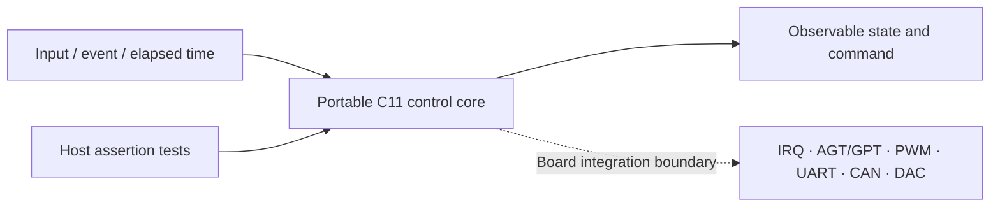
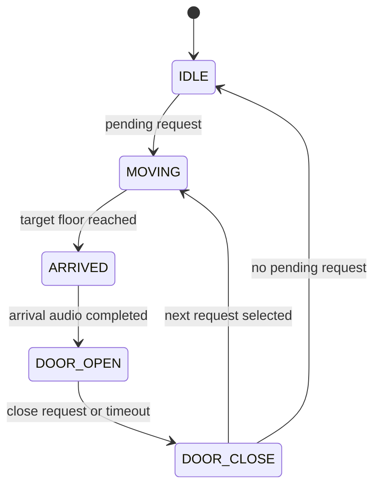
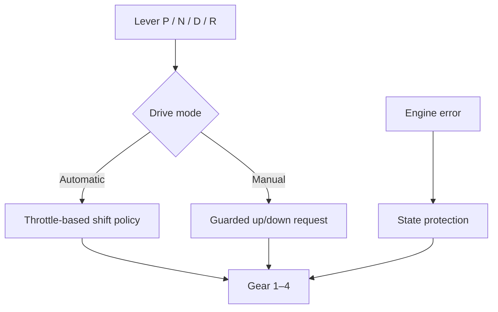

# RA6M3 마이크로프로세서 실습 포트폴리오

[한국어](README.md) | [English](README.en.md)

> Renesas EK-RA6M3 수업에서 구현한 엘리베이터 제어기와 교육용 TCU의 핵심 로직을 **portable C11 상태 머신**으로 분리하고, PC에서 컴파일·검증할 수 있게 정리한 저장소입니다.

| 항목 | 내용 |
|---|---|
| 공개 프로젝트 | 3층 엘리베이터 제어기, 4단 교육용 TCU |
| 핵심 역량 | 상태 머신, non-blocking 제어, timer 기반 전환, peripheral 추상화 |
| 원래 장치 | Renesas EK-RA6M3 / R7FA6M3AH3CFC |
| 공개 검증 | ISO C11 build, assertion 기반 host test |
| 제외 범위 | FSP 생성 코드, 수업 skeleton, pin 설정, 개인정보, 원본 음원 |

## 빠른 탐색

- [`src/elevator.c`](src/elevator.c) · [`include/elevator.h`](include/elevator.h): 엘리베이터 상태·스케줄링 core
- [`tests/test_elevator.c`](tests/test_elevator.c): 엘리베이터 전환과 요청 처리 test
- [`src/tcu.c`](src/tcu.c) · [`include/tcu.h`](include/tcu.h): TCU 모드·변속 core
- [`tests/test_tcu.c`](tests/test_tcu.c): 자동·수동 변속 조건 test
- [`docs/lab-index.md`](docs/lab-index.md): 주차별 수업 내용과 공개 처리 범위

## 1. 프로젝트 개요

보드 종속적인 FSP 초기화와 peripheral 호출 사이에 있던 애플리케이션 로직을 추출해, 입력과 시간만으로 상태가 변하는 작은 C 모듈로 재구성했습니다. 이를 통해 실제 보드 없이도 제어 흐름을 읽고 테스트할 수 있으며, 공개하면 안 되는 생성 코드와 수업 자료는 제외했습니다.



## 2. 엘리베이터 제어기

### 상태 구조



### 구현 내용

- `IDLE → MOVING → ARRIVED → DOOR_OPEN → DOOR_CLOSE`의 5상태 non-blocking 제어
- 3개 층의 요청을 `pending` buffer에 보관
- 현재 진행 방향의 중간층 요청을 우선 처리하는 scheduling
- 경과 시간으로 현재 층과 도착 조건을 갱신
- 도착 음원 재생 완료를 확인한 뒤 문 열림 상태로 전환
- 즉시 닫기 요청 또는 timer 만료에 따른 문 닫힘 처리

원래 보드 제출물은 층 버튼 IRQ, AGT 시간 관리, GPT motor/servo PWM, UART GUI 명령, CAN 상태 frame, FND multiplexing과 DAC 도착 음원을 연결했습니다. 공개 core에서는 peripheral을 입력과 관측 가능한 상태로 치환했습니다.

## 3. 교육용 TCU

### 제어 흐름



### 구현 내용

- P/N/D/R lever 상태와 automatic/manual mode 분리
- 1–4단 gear 상태 관리
- throttle 조건을 이용한 자동 upshift/downshift
- 경계 부근 gear hunting을 줄이기 위한 서로 다른 상승·하강 threshold
- 허용 범위를 벗어난 수동 변속 요청 차단
- 초기화, lever 순환, mode 전환과 변속 정책을 작은 함수로 분리

## 4. My Contribution

- MCU 수업에서 작성한 엘리베이터 scheduling과 TCU 변속 로직을 공개 가능한 core로 분리
- blocking delay 중심 흐름을 `tick(elapsed_ms)` 기반 상태 전환으로 표현
- FSP·보드 peripheral 의존성을 입력, 상태와 함수 경계로 추상화
- 정상 전환뿐 아니라 중간층 요청, mode 변경, 잘못된 입력과 변속 경계를 assertion으로 검증
- 원본 제출물에 포함된 생성 코드·강의 skeleton과 개인정보를 공개 대상에서 제외

이 저장소는 수업 전체 프로젝트나 flash 가능한 e² studio workspace의 복사본이 아니라, 직접 구현한 애플리케이션 제어 로직을 검토 가능하게 추출한 포트폴리오입니다.

## 5. 주요 문제와 해결

| 문제 | 해결 | 검증 |
|---|---|---|
| `delay` 기반 제어는 다른 입력 처리를 막음 | 상태와 경과 시간을 이용한 non-blocking `tick` 구조 | 여러 시간 단계를 순서대로 입력해 상태 전환 확인 |
| 이동 중 추가 요청 처리 순서가 불명확 | `pending` buffer와 방향 우선 scheduling 적용 | 이동 방향의 중간층 정차와 남은 요청 처리 test |
| 도착과 문 동작이 동시에 실행될 수 있음 | `ARRIVED`에서 음원 완료를 명시적으로 기다림 | audio 완료 전후 상태를 분리해 assertion |
| 자동 변속 경계에서 gear가 반복 변경될 수 있음 | up/down threshold를 분리 | 경계 throttle을 반복 입력해 gear 유지 확인 |
| 보드 코드가 없으면 로직을 검토하기 어려움 | peripheral 호출을 입력·출력 인터페이스로 치환 | host compiler의 엄격한 warning 옵션으로 build |

## 6. 빌드 및 테스트

Linux/macOS 또는 GCC가 설치된 환경에서 다음과 같이 확인할 수 있습니다.

```bash
mkdir -p build

gcc -std=c11 -Wall -Wextra -Werror -pedantic \
  -Iinclude src/tcu.c tests/test_tcu.c \
  -o build/test_tcu

gcc -std=c11 -Wall -Wextra -Werror -pedantic \
  -Iinclude src/elevator.c tests/test_elevator.c \
  -o build/test_elevator

./build/test_tcu
./build/test_elevator
```

테스트는 외부 framework 없이 표준 C `assert`를 사용합니다.

## 7. 수업 범위

| 구분 | 확인된 주제 | 공개 처리 |
|---|---|---|
| 3주차 | 외부 interrupt, callback I/O | 문서화만 수행 |
| 4–5주차 | AGT/GPT timer, DC/servo motor PWM | 문서화만 수행 |
| 6–7주차 | ADC/DAC, SCI-UART | 문서화만 수행 |
| 중간 프로젝트 | TCU 상태·자동/수동 변속·출력 | portable TCU core 공개 |
| 기말 프로젝트 | 엘리베이터 scheduling·motor/door·통신·음원 | portable elevator core 공개 |

상세 목록은 [`docs/lab-index.md`](docs/lab-index.md)에 정리했습니다.

## 8. 저장소 구조

```text
.
├─ include/
│  ├─ elevator.h
│  └─ tcu.h
├─ src/
│  ├─ elevator.c
│  └─ tcu.c
├─ tests/
│  ├─ test_elevator.c
│  └─ test_tcu.c
├─ docs/
│  └─ lab-index.md
├─ README.md
└─ README.en.md
```

## 9. 한계와 공개 범위

- 이 저장소만으로 RA6M3 보드에 flash할 수 없습니다.
- hardware pin map, FSP instance와 peripheral adapter를 대상 보드에 맞게 다시 구성해야 합니다.
- 실제 IRQ timing, PWM 파형, CAN bus와 actuator 응답은 host test의 검증 범위가 아닙니다.
- Renesas FSP/RA 생성 source, IDE metadata, 수업 PDF·예제·설치 파일과 sample video를 포함하지 않습니다.
- 개인 식별정보가 포함된 제출 파일명과 원본 PCM 음원을 제외했습니다.

## 10. Attribution

이 저장소의 공개 core와 test는 개인 수업 제출물에서 직접 구현한 애플리케이션 로직을 분리한 것입니다. Renesas FSP 생성 코드와 강의 제공 skeleton은 포함하지 않으며, 해당 자료에 대한 새로운 라이선스나 사용 권한을 부여하지 않습니다.
